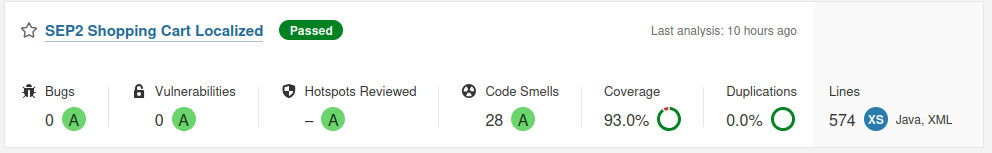

# Sprint 6 Statistical Code Review Report

## Scope

Static analysis for backend and frontend source code to measure:
- Cyclomatic complexity
- Lines of code per method
- Duplicate code
- Potential dead/unreachable code
- Violations and code quality issues

## Tools

- Pylint
- Radon
- Lizard
- JSCPD
- Vulture

## Summary Metrics

| Metric | Result |
| --- | --- |
| Pylint findings | 135 |
| Pylint score | 7.33/10 |
| Average cyclomatic complexity (Radon) | A (1.95) |
| Highest cyclomatic complexity | create_conversation in backend/routes/conversations.py, C (11) |
| Duplicate code (overall, JSCPD) | 8.25% duplicated lines |
| Duplicate code (Python, JSCPD) | 2.38% duplicated lines |
| Duplicate code (JS, JSX, JSCPD) | 17.69% JS, 9.95% JSX duplicated lines |
| Dead/unreachable code (Vulture, confidence >= 80) | No findings |

## LOC Per Method Hotspots

Top methods by NLOC:

| Function | NLOC | CCN |
| --- | ---: | ---: |
| create_conversation (backend/routes/conversations.py) | 41 | 11 |
| send_conversation_message (backend/routes/conversations.py) | 32 | 2 |
| add_participant (backend/routes/conversations.py) | 29 | 4 |
| remove_participant (backend/routes/conversations.py) | 26 | 4 |
| update_profile (backend/routes/auth.py) | 20 | 5 |

## Key Findings

1. Most backend methods are low complexity, but create_conversation is the main hotspot and should be split.
2. Duplicate code is concentrated in frontend page/test files and selected backend route logic.
3. Pylint shows a moderate maintainability baseline (7.33/10) with recurring style/import/docstring issues.
4. No high-confidence dead/unreachable code was detected.

## Evidence Files

Raw outputs are under docs/sprint_report/sprint6/static_analysis:

- pylint_backend.txt
- radon_cc_backend.txt
- lizard_backend.txt
- jscpd.txt
- vulture_backend.txt

## Suggested Improvements & Recommendations
Based on the metrics, the following actions are planned for the Code Clean-Up phase:
1. **Refactor `create_conversation`**: Extract sub-routines from this method in `backend/routes/conversations.py` to reduce its NLOC (41) and Cyclomatic Complexity (11) to acceptable thresholds.
2. **Reduce Frontend Duplication**: Investigate the 17.69% JS duplication in frontend test files and extract common setup logic into reusable utility functions.
3. **Pylint Remediation**: Address the recurring missing docstrings and import order violations to improve the baseline maintainability score above 8.0/10.

## Visual Evidence
